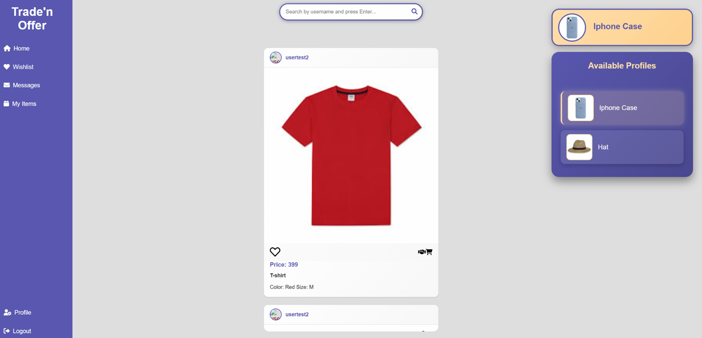
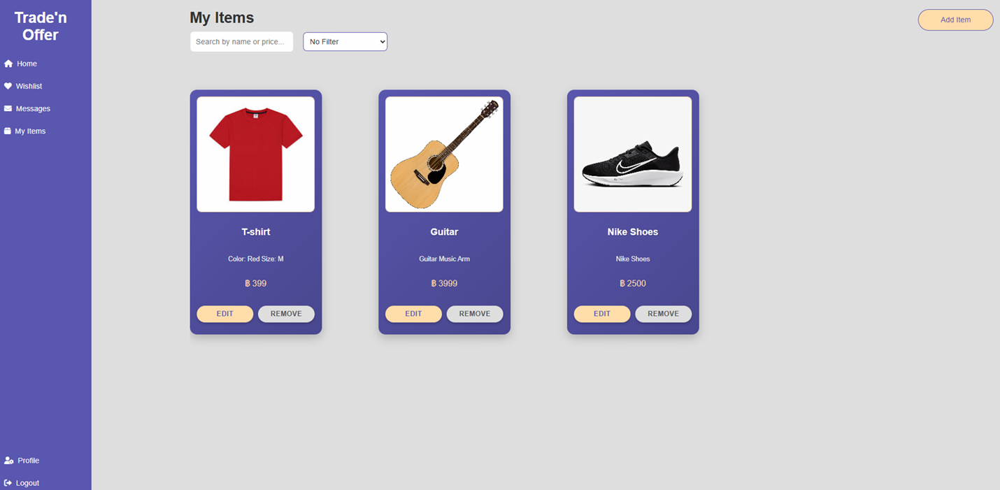
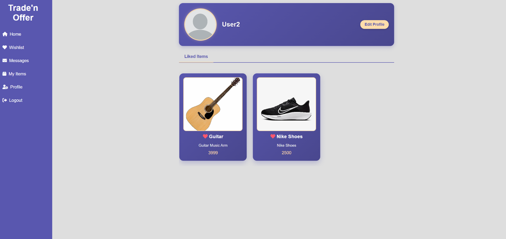
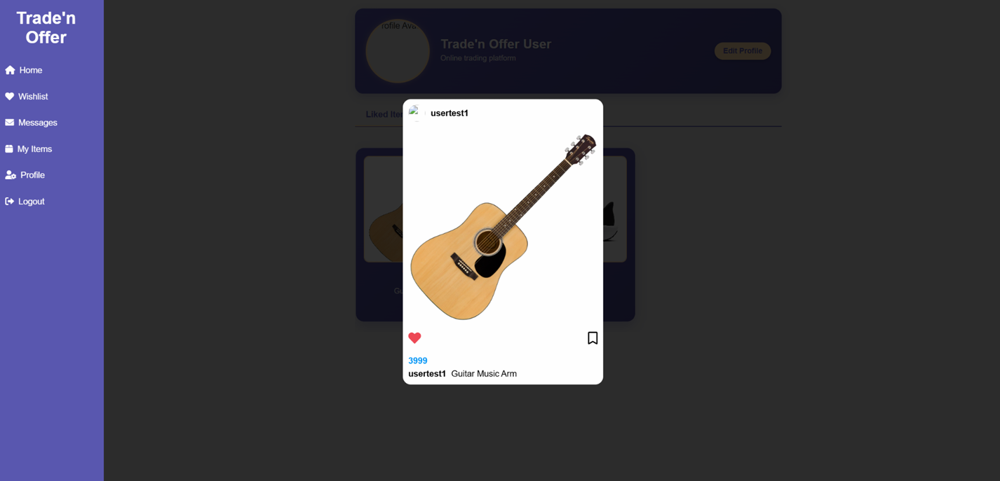

# Trade’n Offer – Item Trading Platform

Full‑stack web application for listing personal items, sending trade/purchase offers, and managing exchanges with real‑time chat.

---

## Screenshots







---

## Features

- User authentication and profile pages.
- Personal inventory: list items, set tradeable/purchasable flags, manage availability.
- Trade offers with pending / accepted / rejected status and automatic ownership transfer.
- Direct purchase flow and purchase offers.
- Wishlist and “active matches” views.
- Real‑time chat rooms per accepted offer (text + images) via Firebase.
- Item metadata (name, description, price, image, category) stored in ZODB, linked with MySQL records.

---

## Tech Stack

- **Backend:** Python, FastAPI, SQLAlchemy, MySQL, ZODB, Pydantic  
- **Realtime & media:** Firebase Realtime Database, Firebase Storage, Firebase Admin SDK  
- **Frontend:** HTML, CSS, JavaScript, Jinja2 templates  
- **Others:** Uvicorn, python‑multipart, requests, python‑dotenv  

Dependencies are listed in `requirements.txt`.

---

## Project Structure

```text
.
├── backend/
│   ├── main.py               # FastAPI app entry point
│   ├── api/
│   │   ├── routes/           # Authentication, items, offers, chat, wishlist, etc.
│   │   ├── models/           # SQLAlchemy models (TradeOffer, Item, User, ...)
│   │   └── services/         # Firebase and other services
│   └── app/                  # DB setup, ZODB setup, session helpers
├── Frontend/
│   ├── static/               # CSS, JS, images
│   └── templates/            # Jinja2 templates (login, trade_offer, chat, profile, ...)
└── requirements.txt
